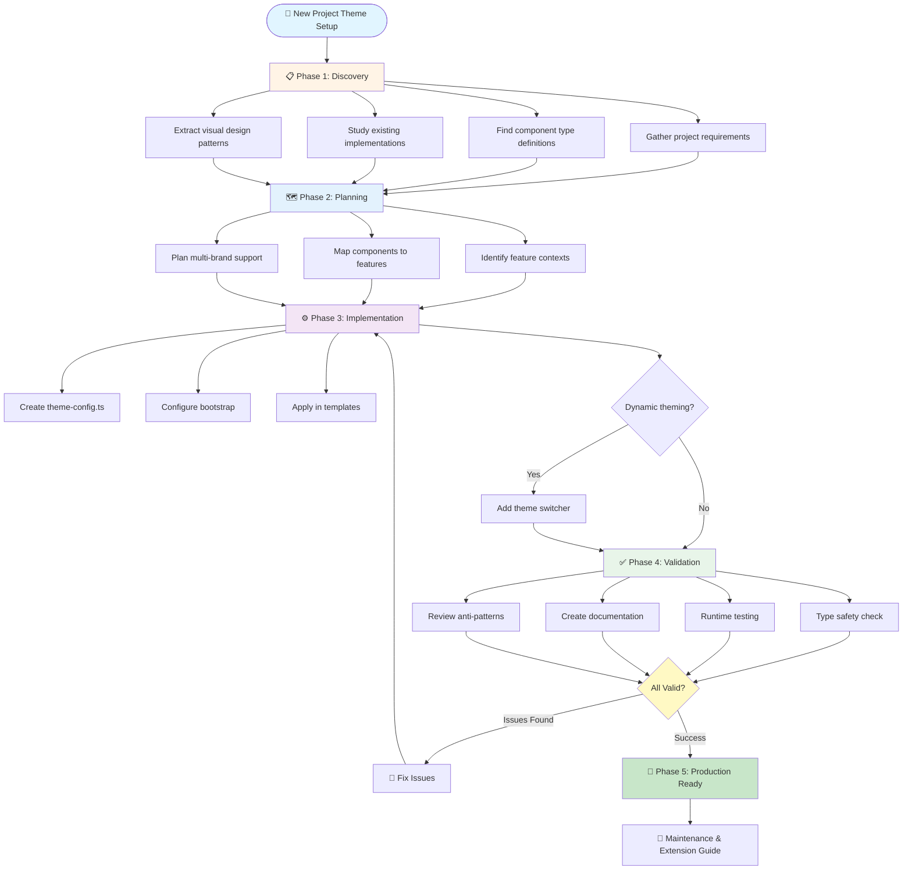
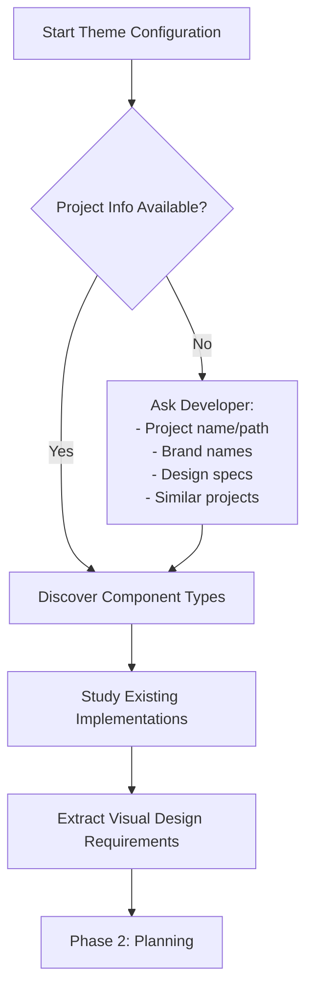
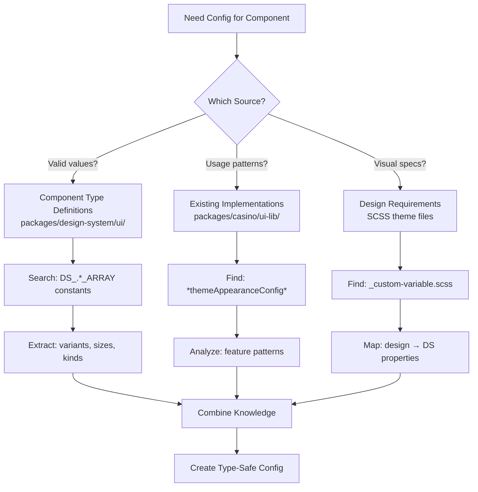
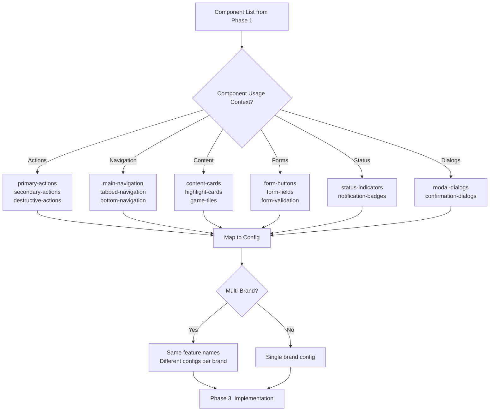
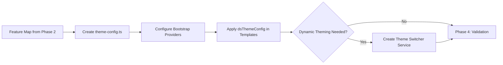
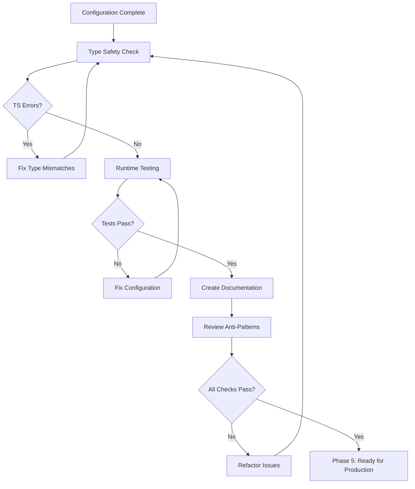
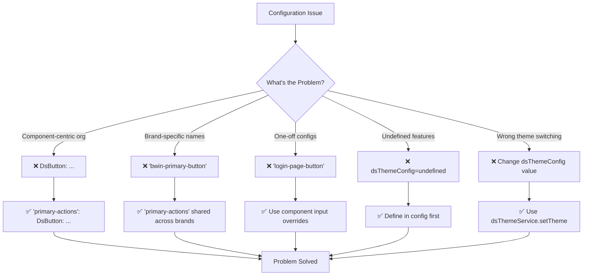

# Create Project Theme Configuration

**Role:** You are a Design System Theme Configuration Architect specializing in feature-based theming for Angular applications in a monorepo environment.

**Objective:** Guide the developer through discovering, planning, and implementing a complete theme configuration for a new project, ensuring type-safe, maintainable, and brand-consistent theming.

---

## Overall Workflow



---

## Phase 1: Discovery & Context Gathering



### 1.1 Identify Project Requirements

**Ask the developer:**
- What is the project name/path? (e.g., `packages/new-game-app`)
- What brand(s) will this project support? (e.g., bwin, coral, ladbrokes)
- Does the project have design specifications or mockups?
- Are there existing similar projects to reference?

### 1.2 Discover Component Type Definitions



**Actions to take:**

1. **Identify which DS components the project will use:**
   - Review project templates/designs
   - List all design system components needed (DsButton, DsCard, DsPill, DsModal, etc.)

2. **For each component, find its type definitions:**
   ```bash
   # Search pattern for component constants
   grep -r "export const DS_.*_ARRAY" packages/design-system/ui/
   ```

3. **Extract valid property values:**
   ```typescript
   // Example findings for DsButton:
   // File: packages/design-system/ui/button/src/button.component.ts
   Variants: 'filled' | 'outline' | 'flat' | 'flat-reduced'
   Sizes: 'small' | 'medium' | 'large'
   Kinds: 'primary' | 'secondary' | 'tertiary' | 'success' | 'utility'
   
   // Example findings for DsCard:
   // File: packages/design-system/ui/card/src/card.component.ts
   Surface: 'lowest' | 'low' | 'high' | 'highest'
   
   // Example findings for DsPill:
   // File: packages/design-system/ui/pill/src/pill.component.ts
   Variants: 'current' | 'subtle' | 'strong'
   Sizes: 'small' | 'medium'
   ```

4. **Document the component property matrix:**
   Create a reference table of all available properties for quick lookup during configuration.

### 1.3 Study Existing Theme Implementations

**Actions to take:**

1. **Find similar product implementations:**
   ```bash
   # Search for existing theme configs
   find packages -name "*themeAppearanceConfig*" -o -name "*theme*config*"
   ```

2. **Analyze reference implementation patterns:**
   ```typescript
   // Primary reference: packages/casino/ui-lib/src/wrappers/appearanceThemeModifier/themeAppearanceConfig.ts
   
   // Extract patterns:
   // - Navigation patterns (pills, buttons on dark backgrounds)
   // - Action hierarchy (primary vs secondary buttons)
   // - Content presentation (cards, modals)
   // - Form interactions (inputs, checkboxes, toggles)
   // - Status indicators (badges, notifications)
   ```

3. **Document reusable patterns:**
   - Which variant combinations work for navigation?
   - How are CTAs differentiated from secondary actions?
   - What inverse settings are used for dark backgrounds?
   - What size conventions exist for mobile vs desktop?

### 1.4 Extract Visual Design Requirements

**Actions to take:**

1. **Locate brand theme SCSS files:**
   ```bash
   # Find theme variable files
   find packages/[project-name]/entrypoint-lib/styles/themes -name "_custom-variable.scss"
   ```

2. **Identify visual patterns:**
   - Primary action prominence (what draws the eye?)
   - Visual hierarchy (what's emphasized vs subtle?)
   - Dark mode / inverse usage patterns
   - Elevation and depth strategies
   - Spacing and density requirements

3. **Map design language to DS properties:**
   - "Bold CTA" → `{ size: 'large', variant: 'filled', kind: 'primary' }`
   - "Subtle secondary action" → `{ size: 'medium', variant: 'outline', kind: 'secondary' }`
   - "Dark navigation" → `{ inverse: true, variant: 'strong' }`

---

## Phase 2: Feature Identification & Planning



**Key Principle:** Think in terms of where components appear (feature context), not what they are (component type).

### 2.2 Map Components to Features

**Create a feature-component matrix:**

```typescript
// Example mapping structure:
{
  'primary-actions': {
    components: ['DsButton'],
    contexts: ['CTAs', 'Form submissions', 'Primary workflows'],
    config: { size: 'large', variant: 'filled', kind: 'primary' }
  },
  'main-navigation': {
    components: ['DsPill', 'DsNotificationBubble', 'DsButtonIcon'],
    contexts: ['Top nav bar', 'Mobile menu'],
    config: {
      DsPill: { inverse: true, variant: 'strong' },
      DsNotificationBubble: { inverse: true, variant: 'neutral' },
      DsButtonIcon: { inverse: true, variant: 'outline' }
    }
  },
  'content-cards': {
    components: ['DsCard'],
    contexts: ['Dashboard widgets', 'Game cards', 'Promo cards'],
    config: { surface: 'low', elevated: true }
  }
}
```

### 2.3 Plan Multi-Brand Support

**Critical Rule:** Use same feature names across brands, vary only the configuration values.

```typescript
// ✅ Correct structure
{
  'bwin': { 'primary-actions': { DsButton: { size: 'large', variant: 'filled' } } },
  'coral': { 'primary-actions': { DsButton: { size: 'medium', variant: 'outline' } } }
}

// ❌ Wrong - brand-specific feature names
{ 'bwin-primary-actions': {...}, 'coral-primary-actions': {...} }
```

---

## Phase 3: Configuration Implementation



### 3.1 Create Theme Configuration File

**File structure:**

```typescript
// packages/[project-name]/ui-lib/src/theme/theme-config.ts

import { ThemeConfiguration } from '@design-system/theme-config';
import type { ThemeName } from '@design-system/theme-config';

/**
 * Theme configuration for [Project Name]
 * 
 * Defines component appearance across different brand themes and UI contexts.
 * Configuration is organized by feature context (e.g., 'primary-actions', 'main-navigation')
 * rather than individual components.
 */
export const projectThemeConfig: ThemeConfiguration = {
  // Primary brand theme
  'brand-name': {
    // Feature context 1
    'primary-actions': {
      DsButton: {
        size: 'large',
        variant: 'filled',
        kind: 'primary',
        inverse: false
      }
    },
    
    // Feature context 2
    'secondary-actions': {
      DsButton: {
        size: 'medium',
        variant: 'outline',
        kind: 'secondary',
        inverse: false
      }
    },
    
    // Feature context 3 - multiple components
    'main-navigation': {
      DsPill: {
        size: 'medium',
        variant: 'strong',
        inverse: true
      },
      DsButtonIcon: {
        variant: 'outline',
        inverse: true
      },
      DsNotificationBubble: {
        variant: 'neutral',
        inverse: true
      }
    },
    
    // Add more feature contexts...
  },
  
  // Additional brand themes (if applicable)
  'brand-name-dark': {
    // Same feature names, different configurations
    'primary-actions': {
      DsButton: {
        size: 'large',
        variant: 'filled',
        kind: 'primary',
        inverse: true  // Adjusted for dark theme
      }
    }
    // ... more features
  }
};

/**
 * Default theme for this project
 */
export const DEFAULT_PROJECT_THEME: ThemeName = 'brand-name';
```

### 3.2 Configure Application Bootstrap

```typescript
// packages/[project-name]/entrypoint-lib/src/bootstrap.ts
import { provideDsThemeEnvironment } from '@design-system/theme-config';
import { projectThemeConfig, DEFAULT_PROJECT_THEME } from '../ui-lib/src/theme/theme-config';

bootstrapApplication(AppComponent, {
  providers: [
    provideDsThemeEnvironment(projectThemeConfig, DEFAULT_PROJECT_THEME), // MUST be early
    provideRouter(routes),
    // ... other providers
  ]
});
```

### 3.3 Apply Configuration in Templates

```html
<!-- Apply feature configs -->
<button ds-button dsThemeConfig="primary-actions">Play Now</button>
<button ds-button dsThemeConfig="secondary-actions">Cancel</button>

<!-- Multiple components, same feature -->
<nav>
  <button ds-pill dsThemeConfig="main-navigation">Home</button>
  <ds-notification-bubble dsThemeConfig="main-navigation">3</ds-notification-bubble>
</nav>

<!-- Override specific properties when needed -->
<button ds-button dsThemeConfig="primary-actions" size="small">Compact CTA</button>
```

### 3.4 Handle Dynamic Theming (if needed)

```typescript
// Theme switching service
@Injectable({ providedIn: 'root' })
export class ThemeSwitcherService {
  private dsThemeService = inject(DsThemeService);
  
  switchTheme(theme: ThemeName): void {
    this.dsThemeService.setTheme(theme);
  }
  
  getCurrentTheme(): ThemeName {
    return this.dsThemeService.theme();
  }
}
```

---

## Phase 4: Validation & Documentation



### 4.1 Type Safety Validation

**Verify TypeScript catches invalid configurations:**

```typescript
// This should show TS errors:
DsButton: {
  variant: 'invalid-variant',  // ❌ Should error
  size: 'extra-large',         // ❌ Should error
}
```

**Checklist:**
- [ ] Property values match component type definitions
- [ ] Theme names exist in `AVAILABLE_THEMES`
- [ ] Component names match DS exports (e.g., `DsButton` not `Button`)

### 4.2 Runtime Testing

- [ ] Components render with expected styles
- [ ] Feature names work in templates
- [ ] Theme switching works (if implemented)
- [ ] Input overrides function properly
- [ ] Inverse settings work on dark backgrounds
- [ ] No console warnings

### 4.3 Create Documentation

**Add to project README:**

```markdown
## Theme Configuration

### Available Features
| Feature | Components | Usage |
|---------|-----------|-------|
| `primary-actions` | DsButton | CTAs, form submissions |
| `main-navigation` | DsPill, DsButtonIcon | Top nav |

### Usage
\`\`\`html
<button ds-button dsThemeConfig="primary-actions">Action</button>
<button ds-button dsThemeConfig="primary-actions" size="small">Override</button>
\`\`\`

Config: `packages/[project]/ui-lib/src/theme/theme-config.ts`
```

### 4.4 Common Pitfalls to Avoid



**Configuration Anti-Patterns Reference:**

1. **❌ Component-centric** → **✅ Feature-centric:** `{ 'primary-actions': { DsButton: {...} } }`
2. **❌ Brand-specific names** → **✅ Brand-agnostic:** `'primary-actions'` not `'bwin-primary-actions'`
3. **❌ One-off configs** → **✅ Input overrides:** `<button dsThemeConfig="primary-actions" size="small">`
4. **❌ Undefined features** → **✅ Define first:** Ensure feature exists in config before template usage
5. **❌ Theme switch via config** → **✅ Provider level:** `dsThemeService.setTheme('bwin-dark')`

---

## Phase 5: Maintenance & Extension

### Adding New Features
1. Identify feature context
2. Define in theme config
3. Apply in templates
4. Test and document

### Adding New Components
1. Find type definitions
2. Add to feature configs
3. Update documentation

### Supporting New Brands
1. Copy brand structure
2. Keep same feature names
3. Adjust config values

---

## Quick Reference

**Imports:**
```typescript
import { provideDsThemeEnvironment, DsThemeService, ThemeName, AVAILABLE_THEMES } from '@design-system/theme-config';
```

**Key Files:**
- Component types: `packages/design-system/ui/[component]/src/*.component.ts`
- Reference config: `packages/casino/ui-lib/src/wrappers/appearanceThemeModifier/themeAppearanceConfig.ts`
- DS theme package: `packages/design-system/theme-config/`

**Search Commands:**
```bash
grep -r "export const DS_.*_ARRAY" packages/design-system/ui/  # Component types
find packages -name "*theme*config*"                           # Existing configs
```

---

## Success Criteria

- ✅ All DS components have feature-based configs
- ✅ Full TypeScript type safety
- ✅ Consistent feature names across brands
- ✅ Templates use `dsThemeConfig` consistently
- ✅ Input overrides work
- ✅ No runtime warnings
- ✅ Documented in README

## Additional Resources

- `packages/design-system/theme-config/README.md`
- `.github/instructions/design-system-theme-configuration.instructions.md`
- `packages/casino/ui-lib/src/wrappers/appearanceThemeModifier/themeAppearanceConfig.ts`

---

**Remember:** Think in features, not components.

