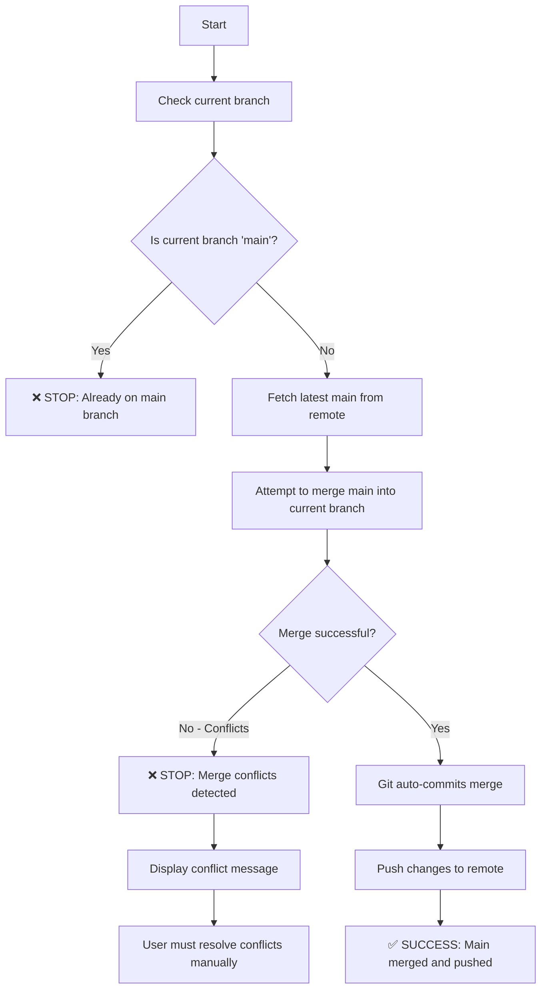

# Merge Main Branch

**Purpose**: Automatically merge the latest main branch into the current branch with conflict detection and proper error handling.



## Steps

1. **Check Current Branch**
   ```bash
   current_branch=$(git branch --show-current)
   if [ "$current_branch" = "main" ]; then
     echo "❌ Already on main branch. Nothing to merge."
     exit 1
   fi
   ```

2. **Fetch Latest Main**
   ```bash
   git fetch origin main
   ```

3. **Merge Main Branch**
   ```bash
   git merge origin/main
   ```
   - Git automatically commits the merge with standard message if no conflicts
   - If conflicts occur, the command will stop with a message
   - User must resolve conflicts manually before proceeding

4. **Push to Remote**
   ```bash
   git push
   ```

## Error Handling

- **On main branch**: Command stops with clear message
- **Merge conflicts**: Command stops and prompts user to resolve conflicts manually
- **Push failures**: Standard git error handling applies

## Usage

Run this command from any branch (except main) to automatically merge the latest main branch changes.
